mesopelagic.rpath
================

CODE information
----------------

Originally from Kerim Aydin (<kerim.aydin@noaa.gov>) from July 10th, 2019
=========================================================================

Modified by Laura Koehn - Fall 2019
===================================

``` r
library(tidyverse)
```

    ## ── Attaching packages ────────────────────────────────────────────────────────────────────────── tidyverse 1.3.0 ──

    ## ✓ ggplot2 3.2.1     ✓ purrr   0.3.3
    ## ✓ tibble  2.1.3     ✓ dplyr   0.8.3
    ## ✓ tidyr   1.0.0     ✓ stringr 1.4.0
    ## ✓ readr   1.3.1     ✓ forcats 0.4.0

    ## ── Conflicts ───────────────────────────────────────────────────────────────────────────── tidyverse_conflicts() ──
    ## x dplyr::filter() masks stats::filter()
    ## x dplyr::lag()    masks stats::lag()

``` r
library(data.table)
```

    ## 
    ## Attaching package: 'data.table'

    ## The following objects are masked from 'package:dplyr':
    ## 
    ##     between, first, last

    ## The following object is masked from 'package:purrr':
    ## 
    ##     transpose

Start of Koehn's code
=====================

``` r
#Rpath uses a parameter object created by create.rpath.params to conduct the mass balance of the system
library(Rpath)

Cbase <- "../Data/Groupinfo_CalCur-USE.csv"  # Base biomass, production, fishing, etc.
Cdiet <- "../Data/Diet_CalCur_USE.csv"  # Diet matrix
```

``` r
# Load unbalanced Ecopath model from csv files 
#Created parameter files outside of R and read in using read.rpath.params function. This merges several different flat files into an R object of the list type. The function create.rpath.params will generate an Rpath.param. This ensures that all of the correct columns are present in the parameter file. 
CalCur_unbal <- read.rpath.params(Cbase, Cdiet)
check.rpath.params(CalCur_unbal)
```

    ## Rpath parameter file is functional

Running Ecopath in R: balanced an unbalanced Ecopath object
===========================================================

``` r
#Balance the scenario using rpath function 
Cal_bal   <- rpath(CalCur_unbal) 
Cal_bal
```

    ## Rpath model: NA 
    ## Model Area: 1 
    ##      Status: Balanced
    ##                 Group type       TL      Biomass           PB         QB
    ## 1       phytoplankton    1 1.000000 33.480949610 120.00000000   0.000000
    ## 2             infauna    0 2.000000 26.686092790   2.50000000  12.000000
    ## 3           amphipods    0 2.000000  6.431812122   3.50000000  22.000000
    ## 4          epibenthic    0 2.450000  8.451087686   2.00000000  10.000000
    ## 5          micro-zoop    0 2.000000  2.092608052 100.00000000 300.000000
    ## 6            copepods    0 2.200000  8.723424851  14.00000000  70.000000
    ## 7         euphausiids    0 2.110000 16.534043660   8.00000000  40.000000
    ## 8        carniv-zoops    0 3.144228  7.209817121   2.00000000  10.000000
    ## 9       small jellies    0 2.250000  1.255886382   9.00000000  30.000000
    ## 10      large jellies    0 3.161385  1.248589922   3.00000000  12.000000
    ## 11       pandalid shp    0 2.748827  0.600169032   2.00000000  10.000000
    ## 12        benthic shp    0 3.041056  1.192872404   2.50000000  12.000000
    ## 13          Dungeness    0 3.492121  0.713867747   0.75000000   3.800000
    ## 14         tanner crb    0 2.963100  0.787028522   0.30000000   1.500000
    ## 15       mesopelagics    0 3.234969  9.933774834   0.60000000   3.000000
    ## 16       Benthic fish    0 3.275579  2.982147534   0.50000000   2.500000
    ## 17         surf perch    0 3.168578  0.093526088   1.30000000   6.000000
    ## 18      Other cephal.    0 3.367364  2.249869465   2.00000000   6.000000
    ## 19       Market squid    0 3.885714  0.717206129   2.75000000  10.000000
    ## 20            Sardine    0 2.860346  3.240503311   0.51500000   5.000000
    ## 21            Anchovy    0 2.797022  1.501728568   1.09000000   6.000000
    ## 22            Herring    0 3.201024  0.662251656   1.60000000   7.489000
    ## 23   Pacific Mackerel    0 3.365890  0.491839073   0.51400000   6.000000
    ## 24         Sand lance    0 3.186900  0.783620019   1.00000000   3.650000
    ## 25    Whitebait smelt    0 3.520097  0.080273200   1.60000000   6.000000
    ## 26        Other smelt    0 3.391854  0.445290626   1.50000000   6.000000
    ## 27              Saury    0 3.258855  1.149668874   1.60000000   3.650000
    ## 28         Juv. rock.    0 3.265436  0.883201256   1.50000000   6.000000
    ## 29          Juv. hake    0 3.233723  1.169427883   1.75021900   6.100870
    ## 30         Juv. flat.    0 3.105616  0.836439491   1.00000000   4.000000
    ## 31        Juv. round.    0 3.234945  0.203800081   1.50000000   5.125006
    ## 32       Juv. thorny.    0 3.393557  0.288943074   0.50000000   2.500000
    ## 33   Yellowtail rock.    0 3.559166  0.545163633   0.14600000   1.700000
    ## 34        Black rock.    0 3.881265  0.124201100   0.12900000   2.010000
    ## 35    Nearshore rock.    0 3.845872  0.080123990   0.15800000   2.010000
    ## 36    Yelloweye rock.    0 4.028206  0.008983841   0.05050000   2.200000
    ## 37       Greenstriped    0 3.806265  0.097823179   0.12500000   2.200000
    ## 38        Shelf rock.    0 3.542960  0.439965033   0.15900000   2.200000
    ## 39         Shortbelly    0 3.152464  0.360264901   0.26000000   2.200000
    ## 40       Petrale sole    0 3.992968  0.078555298   0.32000000   1.700000
    ## 41            Halibut    0 4.171171  0.185129440   0.47000000   2.120000
    ## 42               Hake    0 3.421019  8.043867215   0.41000000   1.956522
    ## 43            Lingcod    0 4.230399  0.312460265   0.29500000   2.400000
    ## 44         Arrowtooth    0 4.175573  0.344084437   0.26400000   2.120000
    ## 45          Sablefish    0 4.009401  0.896231788   0.09840000   2.000000
    ## 46           Albacore    0 4.150771  0.095615672   0.36000000   7.300000
    ## 47             Salmon    0 3.897921  0.124642576   1.76000000   5.300000
    ## 48         Grenadiers    0 3.564053  0.364355660   0.20000000   1.000000
    ## 49            Dogfish    0 3.940244  0.859089052   0.06940000   2.500000
    ## 50       Canary rock.    0 3.179607  0.077562914   0.11300000   1.660000
    ## 51     P. Ocean Perch    0 3.320810  0.100933775   0.06890000   2.070000
    ## 52        Widow rock.    0 3.522053  0.259449283   0.12870000   2.200000
    ## 53    Splitnose rock.    0 3.315296  0.336721589   0.07478000   1.910000
    ## 54        Slope rock.    0 3.353998  0.230325174   0.06465000   1.910000
    ## 55 Shortspine thorny.    0 3.987910  1.098132450   0.05450000   0.470000
    ## 56  Longspine thorny.    0 3.716613  0.308796556   0.12130000   0.350000
    ## 57           Flatfish    0 3.084972  3.569360530   0.35000000   2.000000
    ## 58             Skates    0 4.015598  0.402417970   0.22160000   2.000000
    ## 59             Sharks    0 4.381881  0.036749042   0.18000000   2.800000
    ## 60       Common murre    0 4.249879  0.003271902   0.08409193 169.500000
    ## 61    Cassin's auklet    0 3.167027  0.001226230   0.23387710 266.900000
    ## 62      Rhino. auklet    0 4.156984  0.000276258   0.11898230 202.200000
    ## 63      Tufted Puffin    0 4.151230  0.000181000   0.06500000 181.100000
    ## 64         Cali. gull    0 4.391800  0.000651829   0.13528960 193.900000
    ## 65       Western Gull    0 4.246719  0.000963162   0.13216120 168.650000
    ## 66          Kittiwake    0 4.653298  0.000127000   0.09288535 216.200000
    ## 67          Albatross    0 4.339085  0.000751347   0.04042195 124.250000
    ## 68             Fulmar    0 4.265673  0.000240520   0.04337987 199.700000
    ## 69         Shearwater    0 4.212800  0.003636380   0.07000000 182.750000
    ## 70  Leach's S. Petrel    0 3.853077  0.000596010   0.12404120 407.900000
    ## 71    Transient Orcas    0 4.362452  0.002673169   0.02542091  14.875907
    ## 72     Resident Orcas    0 4.673938  0.001094942   0.02542091  14.875907
    ## 73          Porpoises    0 4.383196  0.026510643   0.07000000  36.520000
    ## 74     Humpback whale    0 3.442436  0.249932809   0.03770000   7.580000
    ## 75        Minke whale    0 3.524754  0.005196272   0.05110000   8.690000
    ## 76          Fin whale    0 3.330491  0.140079437   0.03770000   6.516856
    ## 77        Sperm whale    0 4.431662  0.018288552   0.02100000   8.812000
    ## 78       Harbor seals    0 4.299696  0.019624161   0.08265000  24.594000
    ## 79          Sea Lions    0 4.344687  0.098724885   0.07600000  15.100000
    ## 80     Juv. Ele. Seal    0 4.525530  0.037952869   0.31037500  14.760000
    ## 81 Adult N. Ele. Seal    0 4.236146  0.077504106   0.22759091  14.760000
    ## 82          Fur seals    0 4.350762  0.007867377   0.09100000  52.040000
    ## 83         Blue whale    0 3.110000  0.639381628   0.05000000   5.500000
    ## 84         Gray whale    0 3.026741  0.973494401   0.03700000  11.829333
    ## 85           Dolphins    0 4.290956  0.071282689   0.07562789  32.330000
    ## 86     Brandt's corm.    0 4.174475  0.000725157   0.23500000 138.100000
    ## 87       Double corm.    0 4.121730  0.000364417   0.15000000 147.000000
    ## 88  Pelagic cormorant    0 4.255573  0.000263421   0.15000000 142.600000
    ## 89           Murrelet    0 4.042518  0.000027800   0.12077220 255.100000
    ## 90   Pigeon Guillemot    0 4.237035  0.000095000   0.17500000 205.900000
    ## 91       Caspian tern    0 4.455884  0.000093600   0.10886610 189.900000
    ## 92      Brown Pelican    0 3.852619  0.000270332   0.20000000 120.700000
    ## 93           Detritus    2 1.000000 10.000000000 309.00577549   0.000000
    ## 94             Fleet1    3 4.338428  0.000000000   0.00000000   0.000000
    ##            EE           GE     Removals
    ## 1  0.40093430 0.0000000000 0.0000000000
    ## 2  0.84009550 0.2083333333 0.0000000000
    ## 3  0.80000000 0.1590909091 0.0000000000
    ## 4  0.80000000 0.2000000000 0.0000000000
    ## 5  0.80000000 0.3333333333 0.0000000000
    ## 6  0.80000000 0.2000000000 0.0000000000
    ## 7  0.80000000 0.2000000000 0.0000000000
    ## 8  0.80000000 0.2000000000 0.0000000000
    ## 9  0.80000000 0.3000000000 0.0000000000
    ## 10 0.80000000 0.2500000000 0.0000000000
    ## 11 0.80000000 0.2000000000 0.1055794700
    ## 12 0.80000000 0.2083333333 0.0001026490
    ## 13 0.64167930 0.1973684211 0.0919772950
    ## 14 0.80000000 0.2000000000 0.0000000000
    ## 15 0.54496345 0.2000000000 0.0000000000
    ## 16 0.80000000 0.2000000000 0.0000000000
    ## 17 0.80000000 0.2166666667 0.0000000000
    ## 18 0.80000000 0.3333333333 0.0000000000
    ## 19 0.80000000 0.2750000000 0.2669866520
    ## 20 0.85811912 0.1030000000 0.4874827810
    ## 21 0.92269727 0.1816666667 0.0386612580
    ## 22 0.99158987 0.2136466818 0.0064607320
    ## 23 0.52490425 0.0856666667 0.0268937090
    ## 24 0.80000000 0.2739726027 0.0000000000
    ## 25 0.90152278 0.2666666667 0.0000000000
    ## 26 0.80000000 0.2500000000 0.0000000000
    ## 27 0.15943974 0.4383561644 0.0000000000
    ## 28 0.80000000 0.2500000000 0.0000000000
    ## 29 0.80000000 0.2868802318 0.0000000000
    ## 30 0.80000000 0.2500000000 0.0000000000
    ## 31 0.80000000 0.2926825842 0.0000000000
    ## 32 0.80000000 0.2000000000 0.0000000000
    ## 33 0.76459386 0.0858823529 0.0137725330
    ## 34 0.74422635 0.0641791045 0.0031473590
    ## 35 0.67228078 0.0786069652 0.0016856190
    ## 36 0.15387197 0.0229545455 0.0000440000
    ## 37 0.47405490 0.0568181818 0.0001251440
    ## 38 0.59826486 0.0722727273 0.0015279530
    ## 39 0.86802232 0.1181818182 0.0000000248
    ## 40 0.89358613 0.1882352941 0.0053510240
    ## 41 0.08621875 0.2216981132 0.0031873620
    ## 42 0.78966499 0.2095555276 0.9468963580
    ## 43 0.65736456 0.1229166667 0.0036357140
    ## 44 0.62102327 0.1245283019 0.0341984720
    ## 45 0.68585001 0.0492000000 0.0250242410
    ## 46 0.11395337 0.0493150685 0.0036447760
    ## 47 0.95437371 0.3320754717 0.0253670200
    ## 48 0.44441700 0.2000000000 0.0003643900
    ## 49 0.96631958 0.0277600000 0.0047424060
    ## 50 0.64799752 0.0680722892 0.0021803700
    ## 51 0.97069735 0.0332850242 0.0022779470
    ## 52 0.98775834 0.0585000000 0.0050900410
    ## 53 0.94919016 0.0391518325 0.0012060300
    ## 54 0.92552770 0.0338481675 0.0030438130
    ## 55 0.52724020 0.1159574468 0.0035020400
    ## 56 0.93856347 0.3465714286 0.0030780290
    ## 57 0.89000334 0.1750000000 0.0490173190
    ## 58 0.49099856 0.1108000000 0.0039412290
    ## 59 0.75000000 0.0642857143 0.0026756800
    ## 60 0.00000000 0.0004961176 0.0000000000
    ## 61 0.00000000 0.0008762724 0.0000000000
    ## 62 0.00000000 0.0005884387 0.0000000000
    ## 63 0.00000000 0.0003589177 0.0000000000
    ## 64 0.00000000 0.0006977287 0.0000000000
    ## 65 0.00000000 0.0007836419 0.0000000000
    ## 66 0.00000000 0.0004296270 0.0000000000
    ## 67 0.00000000 0.0003253276 0.0000000000
    ## 68 0.00000000 0.0002172252 0.0000000000
    ## 69 0.00000000 0.0003830369 0.0000000000
    ## 70 0.00000000 0.0003040971 0.0000000000
    ## 71 0.00000000 0.0017088646 0.0000000000
    ## 72 0.00000000 0.0017088646 0.0000000000
    ## 73 0.92194755 0.0019167579 0.0000000000
    ## 74 0.08376586 0.0049736148 0.0000000000
    ## 75 0.12359968 0.0058803222 0.0000000000
    ## 76 0.16753172 0.0057849980 0.0000000000
    ## 77 0.23810114 0.0023831139 0.0000000000
    ## 78 0.37361366 0.0033605758 0.0000000000
    ## 79 0.39187805 0.0050331126 0.0000000000
    ## 80 0.00000000 0.0210281165 0.0000000000
    ## 81 0.18560349 0.0154194383 0.0000000000
    ## 82 0.03818101 0.0017486549 0.0000000000
    ## 83 0.06526478 0.0090909091 0.0000000000
    ## 84 0.11629435 0.0031278179 0.0000000000
    ## 85 0.08351345 0.0023392481 0.0000000000
    ## 86 0.00000000 0.0017016655 0.0000000000
    ## 87 0.00000000 0.0010204082 0.0000000000
    ## 88 0.00000000 0.0010518934 0.0000000000
    ## 89 0.00000000 0.0004734308 0.0000000000
    ## 90 0.00000000 0.0008499271 0.0000000000
    ## 91 0.00000000 0.0005732812 0.0000000000
    ## 92 0.00000000 0.0016570008 0.0000000000
    ## 93 0.21064833 0.0000000000 0.0000000000
    ## 94 0.00000000 0.0000000000 0.0000000000

``` r
#Combine two data frames into a single data frame 
cbind(Cal_bal$Group, Cal_bal$EE)
```

    ##       [,1]                 [,2]                
    ##  [1,] "phytoplankton"      "0.400934299995626" 
    ##  [2,] "infauna"            "0.840095500025935" 
    ##  [3,] "amphipods"          "0.799999999998098" 
    ##  [4,] "epibenthic"         "0.800000000084931" 
    ##  [5,] "micro-zoop"         "0.800000000170035" 
    ##  [6,] "copepods"           "0.800000000038099" 
    ##  [7,] "euphausiids"        "0.799999999953585" 
    ##  [8,] "carniv-zoops"       "0.799999999810293" 
    ##  [9,] "small jellies"      "0.800000000202641" 
    ## [10,] "large jellies"      "0.799999999635965" 
    ## [11,] "pandalid shp"       "0.799999999438076" 
    ## [12,] "benthic shp"        "0.799999999730382" 
    ## [13,] "Dungeness"          "0.641679299930234" 
    ## [14,] "tanner crb"         "0.800000000449344" 
    ## [15,] "mesopelagics"       "0.544963454477828" 
    ## [16,] "Benthic fish"       "0.799999999996053" 
    ## [17,] "surf perch"         "0.80000000163069"  
    ## [18,] "Other cephal."      "0.799999999995212" 
    ## [19,] "Market squid"       "0.800000000506996" 
    ## [20,] "Sardine"            "0.85811912347961"  
    ## [21,] "Anchovy"            "0.92269727414615"  
    ## [22,] "Herring"            "0.991589874252985" 
    ## [23,] "Pacific Mackerel"   "0.524904245625473" 
    ## [24,] "Sand lance"         "0.799999999714066" 
    ## [25,] "Whitebait smelt"    "0.901522781805876" 
    ## [26,] "Other smelt"        "0.799999999897983" 
    ## [27,] "Saury"              "0.159439740342798" 
    ## [28,] "Juv. rock."         "0.799999999937266" 
    ## [29,] "Juv. hake"          "0.799999999820803" 
    ## [30,] "Juv. flat."         "0.800000000285551" 
    ## [31,] "Juv. round."        "0.800000000602"    
    ## [32,] "Juv. thorny."       "0.79999999972615"  
    ## [33,] "Yellowtail rock."   "0.76459385705311"  
    ## [34,] "Black rock."        "0.744226347510654" 
    ## [35,] "Nearshore rock."    "0.672280775022467" 
    ## [36,] "Yelloweye rock."    "0.153871966952579" 
    ## [37,] "Greenstriped"       "0.474054900552403" 
    ## [38,] "Shelf rock."        "0.598264860375646" 
    ## [39,] "Shortbelly"         "0.868022318305008" 
    ## [40,] "Petrale sole"       "0.893586131413603" 
    ## [41,] "Halibut"            "0.0862187528995764"
    ## [42,] "Hake"               "0.789664988868558" 
    ## [43,] "Lingcod"            "0.65736456433487"  
    ## [44,] "Arrowtooth"         "0.6210232742535"   
    ## [45,] "Sablefish"          "0.685850011151543" 
    ## [46,] "Albacore"           "0.113953374694284" 
    ## [47,] "Salmon"             "0.954373713836334" 
    ## [48,] "Grenadiers"         "0.44441699948454"  
    ## [49,] "Dogfish"            "0.966319580993823" 
    ## [50,] "Canary rock."       "0.647997524780789" 
    ## [51,] "P. Ocean Perch"     "0.970697352267746" 
    ## [52,] "Widow rock."        "0.987758335633809" 
    ## [53,] "Splitnose rock."    "0.949190158217049" 
    ## [54,] "Slope rock."        "0.925527703568394" 
    ## [55,] "Shortspine thorny." "0.527240202096897" 
    ## [56,] "Longspine thorny."  "0.938563473290229" 
    ## [57,] "Flatfish"           "0.890003342646753" 
    ## [58,] "Skates"             "0.490998561428978" 
    ## [59,] "Sharks"             "0.750000003000423" 
    ## [60,] "Common murre"       "0"                 
    ## [61,] "Cassin's auklet"    "0"                 
    ## [62,] "Rhino. auklet"      "0"                 
    ## [63,] "Tufted Puffin"      "0"                 
    ## [64,] "Cali. gull"         "0"                 
    ## [65,] "Western Gull"       "0"                 
    ## [66,] "Kittiwake"          "0"                 
    ## [67,] "Albatross"          "0"                 
    ## [68,] "Fulmar"             "0"                 
    ## [69,] "Shearwater"         "0"                 
    ## [70,] "Leach's S. Petrel"  "0"                 
    ## [71,] "Transient Orcas"    "0"                 
    ## [72,] "Resident Orcas"     "0"                 
    ## [73,] "Porpoises"          "0.92194754865381"  
    ## [74,] "Humpback whale"     "0.083765862975746" 
    ## [75,] "Minke whale"        "0.123599680513983" 
    ## [76,] "Fin whale"          "0.167531718886477" 
    ## [77,] "Sperm whale"        "0.238101135322164" 
    ## [78,] "Harbor seals"       "0.373613658157904" 
    ## [79,] "Sea Lions"          "0.391878054002744" 
    ## [80,] "Juv. Ele. Seal"     "0"                 
    ## [81,] "Adult N. Ele. Seal" "0.185603492032788" 
    ## [82,] "Fur seals"          "0.0381810090510014"
    ## [83,] "Blue whale"         "0.0652647753742657"
    ## [84,] "Gray whale"         "0.116294349121118" 
    ## [85,] "Dolphins"           "0.083513445878776" 
    ## [86,] "Brandt's corm."     "0"                 
    ## [87,] "Double corm."       "0"                 
    ## [88,] "Pelagic cormorant"  "0"                 
    ## [89,] "Murrelet"           "0"                 
    ## [90,] "Pigeon Guillemot"   "0"                 
    ## [91,] "Caspian tern"       "0"                 
    ## [92,] "Brown Pelican"      "0"                 
    ## [93,] "Detritus"           "0.210648328059147" 
    ## [94,] "Fleet1"             "0"

``` r
cbind(Cal_bal$Group, Cal_bal$TL) 
```

    ##       [,1]                 [,2]              
    ##  [1,] "phytoplankton"      "1"               
    ##  [2,] "infauna"            "2"               
    ##  [3,] "amphipods"          "2"               
    ##  [4,] "epibenthic"         "2.45"            
    ##  [5,] "micro-zoop"         "2"               
    ##  [6,] "copepods"           "2.2"             
    ##  [7,] "euphausiids"        "2.11"            
    ##  [8,] "carniv-zoops"       "3.14422769107643"
    ##  [9,] "small jellies"      "2.25"            
    ## [10,] "large jellies"      "3.16138455382153"
    ## [11,] "pandalid shp"       "2.74882683073229"
    ## [12,] "benthic shp"        "3.04105615842376"
    ## [13,] "Dungeness"          "3.49212106980484"
    ## [14,] "tanner crb"         "2.9631"          
    ## [15,] "mesopelagics"       "3.23496892488284"
    ## [16,] "Benthic fish"       "3.27557864062897"
    ## [17,] "surf perch"         "3.16857771567533"
    ## [18,] "Other cephal."      "3.36736407694679"
    ## [19,] "Market squid"       "3.88571381458945"
    ## [20,] "Sardine"            "2.86034569425923"
    ## [21,] "Anchovy"            "2.79702236414091"
    ## [22,] "Herring"            "3.2010239832161" 
    ## [23,] "Pacific Mackerel"   "3.36589017961321"
    ## [24,] "Sand lance"         "3.18689981446801"
    ## [25,] "Whitebait smelt"    "3.52009703475906"
    ## [26,] "Other smelt"        "3.39185401871352"
    ## [27,] "Saury"              "3.25885482188372"
    ## [28,] "Juv. rock."         "3.26543612196651"
    ## [29,] "Juv. hake"          "3.23372304255124"
    ## [30,] "Juv. flat."         "3.10561584237636"
    ## [31,] "Juv. round."        "3.23494543741756"
    ## [32,] "Juv. thorny."       "3.39355692276911"
    ## [33,] "Yellowtail rock."   "3.55916571421415"
    ## [34,] "Black rock."        "3.8812653356859" 
    ## [35,] "Nearshore rock."    "3.84587183013712"
    ## [36,] "Yelloweye rock."    "4.02820568040911"
    ## [37,] "Greenstriped"       "3.80626508965878"
    ## [38,] "Shelf rock."        "3.54296043880014"
    ## [39,] "Shortbelly"         "3.15246410299419"
    ## [40,] "Petrale sole"       "3.99296796708707"
    ## [41,] "Halibut"            "4.17117114123545"
    ## [42,] "Hake"               "3.4210193872426" 
    ## [43,] "Lingcod"            "4.23039890105776"
    ## [44,] "Arrowtooth"         "4.17557329418885"
    ## [45,] "Sablefish"          "4.0094014985646" 
    ## [46,] "Albacore"           "4.15077078423023"
    ## [47,] "Salmon"             "3.89792096116456"
    ## [48,] "Grenadiers"         "3.56405326813146"
    ## [49,] "Dogfish"            "3.94024430705412"
    ## [50,] "Canary rock."       "3.17960714019945"
    ## [51,] "P. Ocean Perch"     "3.32080973840333"
    ## [52,] "Widow rock."        "3.52205343754059"
    ## [53,] "Splitnose rock."    "3.31529570515359"
    ## [54,] "Slope rock."        "3.35399814248593"
    ## [55,] "Shortspine thorny." "3.98790979777676"
    ## [56,] "Longspine thorny."  "3.71661273571251"
    ## [57,] "Flatfish"           "3.0849715205356" 
    ## [58,] "Skates"             "4.01559823112284"
    ## [59,] "Sharks"             "4.38188079828318"
    ## [60,] "Common murre"       "4.24987851280914"
    ## [61,] "Cassin's auklet"    "3.16702652258049"
    ## [62,] "Rhino. auklet"      "4.15698358958978"
    ## [63,] "Tufted Puffin"      "4.15123020324434"
    ## [64,] "Cali. gull"         "4.39180044328158"
    ## [65,] "Western Gull"       "4.24671895728933"
    ## [66,] "Kittiwake"          "4.65329760668868"
    ## [67,] "Albatross"          "4.33908459101704"
    ## [68,] "Fulmar"             "4.26567277805913"
    ## [69,] "Shearwater"         "4.2128000109947" 
    ## [70,] "Leach's S. Petrel"  "3.8530767035256" 
    ## [71,] "Transient Orcas"    "4.36245187640891"
    ## [72,] "Resident Orcas"     "4.67393822782148"
    ## [73,] "Porpoises"          "4.38319569494497"
    ## [74,] "Humpback whale"     "3.44243572076862"
    ## [75,] "Minke whale"        "3.52475363864387"
    ## [76,] "Fin whale"          "3.33049122340435"
    ## [77,] "Sperm whale"        "4.4316618939224" 
    ## [78,] "Harbor seals"       "4.29969585778451"
    ## [79,] "Sea Lions"          "4.34468734224622"
    ## [80,] "Juv. Ele. Seal"     "4.52553044310778"
    ## [81,] "Adult N. Ele. Seal" "4.23614646551624"
    ## [82,] "Fur seals"          "4.35076151591998"
    ## [83,] "Blue whale"         "3.11"            
    ## [84,] "Gray whale"         "3.02674073133924"
    ## [85,] "Dolphins"           "4.29095614987076"
    ## [86,] "Brandt's corm."     "4.17447507086425"
    ## [87,] "Double corm."       "4.12173016315787"
    ## [88,] "Pelagic cormorant"  "4.25557298252381"
    ## [89,] "Murrelet"           "4.04251782163731"
    ## [90,] "Pigeon Guillemot"   "4.23703530821837"
    ## [91,] "Caspian tern"       "4.45588350520784"
    ## [92,] "Brown Pelican"      "3.85261888317353"
    ## [93,] "Detritus"           "1"               
    ## [94,] "Fleet1"             "4.33842792979201"

``` r
# CHECK****!!?!?!?!!? as some values seem weird --> checked for EE and all values match the ones on the original data set published (this also calculates some not listed there), checekd for trophic level with Field et al. (2004) and all seems normal! 

#webplot: way to make a basic food web plot. Can add many different arguments to change preferences. 
webplot(Cal_bal, eco.name = "California Current",
        labels = TRUE)
```

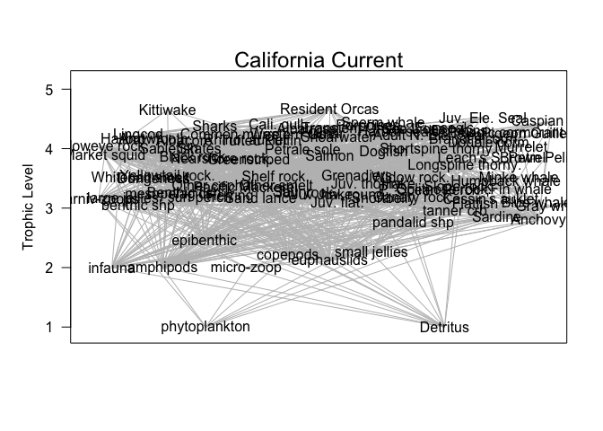

list of species for plotting
============================

``` r
#Define different functional groups
all_species <- Cal_bal$Group[1:92] 
mammals <- Cal_bal$Group[71:85] 
seabirds <- c(Cal_bal$Group[60:70], Cal_bal$Group[86:92])
pred_fish  <- Cal_bal$Group[33:59] 
forage <- Cal_bal$Group[19:27]
```

``` r
#What rsim does: rsim.scenario converts the rpath output to rates appropriate for running the simulation, can adjust base scenario through adjust.scenario, adjust.fishing, and adjust.forcing

yearlist = 2000:2050

# Set up an initial scenario - initializes row labels to match years
#Cal_bal as balanced Rpath model, CalCur_unbal as R object containing Rpath parameters- is generated through read.rpath.params, and years is the vector of each year of simulation (this is simulating year 2,000- 2,050)
base_sim_scene <- rsim.scenario(Cal_bal, CalCur_unbal, years = yearlist)

# Baseline (equilibrium) run, make a copy of the baseline scenario
scene0 <- base_sim_scene

# Rsim.run runs the simulation, Run ecosim once, for indicated years
#AB: is the method of integration, Adams-Bashforth 4 numerical integration, doesn't seem like anything we need to change 
run0   <- rsim.run(scene0, method='AB', years=yearlist) 
rsim.plot(run0,all_species)
```

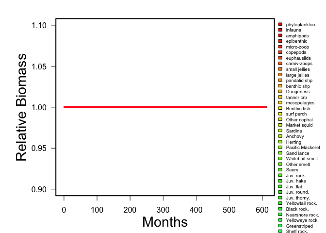

Change fishing rate for certain species and years: Fishing rate of 75% (25% of biomass remaining)
=================================================================================================

``` r
#Scene0 and scene1 are identical, Koehn just redefined it like this so we will too
scene1 <- base_sim_scene
identical(scene0, scene1)
```

    ## [1] TRUE

``` r
#Scene1= Rsim.scenario, parameter here = frate (can modify one of three parameters: effort, frate, adn catch), sardine= group, sim.year= yearlist so saying year of simulation that should be modified (or range), sim.month= month of year that should be modified and if set to 0 then all months are modified 
#VALUE: Returns an Rpath.sim object with the new fishing parameter

scene2 <- adjust.fishing(scene1, "FRATE", "mesopelagics", yearlist, value= 0.25)
run2 <- rsim.run(scene2, method='AB', years=yearlist)
rsim.plot(run2,all_species) 
```

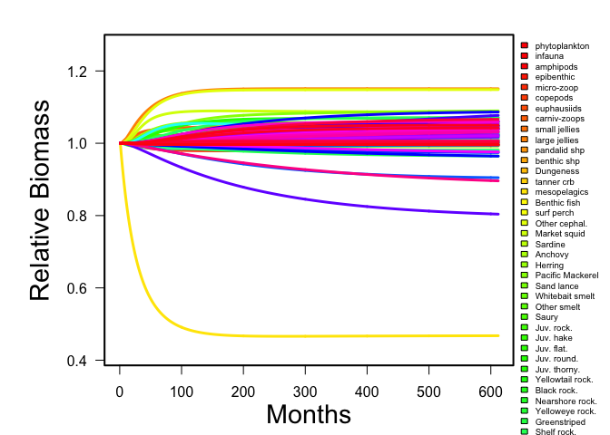

``` r
run2
```

    ## Rpath sim results: NA 
    ##                                 Group     StartBio       EndBio     BioES
    ## Outside                       Outside  1.000000000 1.000000e+00 1.0000000
    ## phytoplankton           phytoplankton 33.480949610 3.332244e+01 0.9952657
    ## infauna                       infauna 26.686092790 2.659393e+01 0.9965465
    ## amphipods                   amphipods  6.431812122 6.488306e+00 1.0087835
    ## epibenthic                 epibenthic  8.451087686 8.419179e+00 0.9962243
    ## micro-zoop                 micro-zoop  2.092608052 2.048727e+00 0.9790305
    ## copepods                     copepods  8.723424851 8.779664e+00 1.0064469
    ## euphausiids               euphausiids 16.534043660 1.724175e+01 1.0428029
    ## carniv-zoops             carniv-zoops  7.209817121 7.547821e+00 1.0468811
    ## small jellies           small jellies  1.255886382 1.283901e+00 1.0223065
    ## large jellies           large jellies  1.248589922 1.436881e+00 1.1508029
    ## pandalid shp             pandalid shp  0.600169032 6.029220e-01 1.0045870
    ## benthic shp               benthic shp  1.192872404 1.184534e+00 0.9930095
    ## Dungeness                   Dungeness  0.713867747 7.129648e-01 0.9987351
    ## tanner crb                 tanner crb  0.787028522 7.878008e-01 1.0009812
    ## mesopelagics             mesopelagics  9.933774834 4.645876e+00 0.4676849
    ## Benthic fish             Benthic fish  2.982147534 2.929477e+00 0.9823380
    ## surf perch                 surf perch  0.093526088 9.295294e-02 0.9938717
    ## Other cephal.           Other cephal.  2.249869465 2.583755e+00 1.1484021
    ## Market squid             Market squid  0.717206129 7.792808e-01 1.0865507
    ## Sardine                       Sardine  3.240503311 3.343878e+00 1.0319007
    ## Anchovy                       Anchovy  1.501728568 1.530216e+00 1.0189701
    ## Herring                       Herring  0.662251656 6.988791e-01 1.0553074
    ## Pacific Mackerel     Pacific Mackerel  0.491839073 5.358638e-01 1.0895104
    ## Sand lance                 Sand lance  0.783620019 7.932490e-01 1.0122878
    ## Whitebait smelt       Whitebait smelt  0.080273200 8.283487e-02 1.0319119
    ## Other smelt               Other smelt  0.445290626 4.551221e-01 1.0220789
    ## Saury                           Saury  1.149668874 1.213163e+00 1.0552284
    ## Juv. rock.                 Juv. rock.  0.883201256 9.059351e-01 1.0257403
    ## Juv. hake                   Juv. hake  1.169427883 1.195463e+00 1.0222634
    ## Juv. flat.                 Juv. flat.  0.836439491 8.306799e-01 0.9931142
    ## Juv. round.               Juv. round.  0.203800081 2.038115e-01 1.0000558
    ## Juv. thorny.             Juv. thorny.  0.288943074 3.093535e-01 1.0706381
    ## Yellowtail rock.     Yellowtail rock.  0.545163633 5.536807e-01 1.0156229
    ## Black rock.               Black rock.  0.124201100 1.315059e-01 1.0588142
    ## Nearshore rock.       Nearshore rock.  0.080123990 8.401363e-02 1.0485453
    ## Yelloweye rock.       Yelloweye rock.  0.008983841 9.198098e-03 1.0238492
    ## Greenstriped             Greenstriped  0.097823179 1.002037e-01 1.0243353
    ## Shelf rock.               Shelf rock.  0.439965033 4.243857e-01 0.9645896
    ## Shortbelly                 Shortbelly  0.360264901 3.857968e-01 1.0708698
    ## Petrale sole             Petrale sole  0.078555298 7.819791e-02 0.9954505
    ## Halibut                       Halibut  0.185129440 1.902345e-01 1.0275756
    ## Hake                             Hake  8.043867215 7.891188e+00 0.9810191
    ## Lingcod                       Lingcod  0.312460265 3.186549e-01 1.0198253
    ## Arrowtooth                 Arrowtooth  0.344084437 3.486201e-01 1.0131819
    ## Sablefish                   Sablefish  0.896231788 9.029414e-01 1.0074864
    ## Albacore                     Albacore  0.095615672 9.778403e-02 1.0226778
    ## Salmon                         Salmon  0.124642576 1.296256e-01 1.0399786
    ## Grenadiers                 Grenadiers  0.364355660 3.728314e-01 1.0232623
    ## Dogfish                       Dogfish  0.859089052 8.775531e-01 1.0214926
    ## Canary rock.             Canary rock.  0.077562914 8.144354e-02 1.0500320
    ## P. Ocean Perch         P. Ocean Perch  0.100933775 1.010249e-01 1.0009025
    ## Widow rock.               Widow rock.  0.259449283 2.645420e-01 1.0196289
    ## Splitnose rock.       Splitnose rock.  0.336721589 3.533414e-01 1.0493578
    ## Slope rock.               Slope rock.  0.230325174 2.311778e-01 1.0037019
    ## Shortspine thorny. Shortspine thorny.  1.098132450 1.070620e+00 0.9749458
    ## Longspine thorny.   Longspine thorny.  0.308796556 2.793844e-01 0.9047524
    ## Flatfish                     Flatfish  3.569360530 3.551896e+00 0.9951072
    ## Skates                         Skates  0.402417970 3.921798e-01 0.9745583
    ## Sharks                         Sharks  0.036749042 3.841052e-02 1.0452114
    ## Common murre             Common murre  0.003271902 3.401477e-03 1.0396023
    ## Cassin's auklet       Cassin's auklet  0.001226230 1.275063e-03 1.0398241
    ## Rhino. auklet           Rhino. auklet  0.000276258 2.930920e-04 1.0609358
    ## Tufted Puffin           Tufted Puffin  0.000181000 1.745490e-04 0.9643590
    ## Cali. gull                 Cali. gull  0.000651829 7.081780e-04 1.0864475
    ## Western Gull             Western Gull  0.000963162 1.000482e-03 1.0387469
    ## Kittiwake                   Kittiwake  0.000127000 1.332994e-04 1.0496018
    ## Albatross                   Albatross  0.000751347 7.742434e-04 1.0304739
    ## Fulmar                         Fulmar  0.000240520 2.590646e-04 1.0771019
    ## Shearwater                 Shearwater  0.003636380 3.857288e-03 1.0607494
    ## Leach's S. Petrel   Leach's S. Petrel  0.000596010 4.791081e-04 0.8038591
    ## Transient Orcas       Transient Orcas  0.002673169 2.678985e-03 1.0021757
    ## Resident Orcas         Resident Orcas  0.001094942 1.113562e-03 1.0170058
    ## Porpoises                   Porpoises  0.026510643 2.776417e-02 1.0472840
    ## Humpback whale         Humpback whale  0.249932809 2.557464e-01 1.0232607
    ## Minke whale               Minke whale  0.005196272 5.477885e-03 1.0541953
    ## Fin whale                   Fin whale  0.140079437 1.429699e-01 1.0206344
    ## Sperm whale               Sperm whale  0.018288552 1.937793e-02 1.0595662
    ## Harbor seals             Harbor seals  0.019624161 1.915223e-02 0.9759517
    ## Sea Lions                   Sea Lions  0.098724885 1.024271e-01 1.0374998
    ## Juv. Ele. Seal         Juv. Ele. Seal  0.037952869 3.941979e-02 1.0386512
    ## Adult N. Ele. Seal Adult N. Ele. Seal  0.077504106 8.216397e-02 1.0601240
    ## Fur seals                   Fur seals  0.007867377 8.134437e-03 1.0339453
    ## Blue whale                 Blue whale  0.639381628 6.591635e-01 1.0309391
    ## Gray whale                 Gray whale  0.973494401 9.807148e-01 1.0074169
    ## Dolphins                     Dolphins  0.071282689 6.386517e-02 0.8959422
    ## Brandt's corm.         Brandt's corm.  0.000725157 7.225336e-04 0.9963822
    ## Double corm.             Double corm.  0.000364417 3.627287e-04 0.9953672
    ## Pelagic cormorant   Pelagic cormorant  0.000263421 2.649903e-04 1.0059574
    ## Murrelet                     Murrelet  0.000027800 2.964442e-05 1.0663460
    ## Pigeon Guillemot     Pigeon Guillemot  0.000095000 9.517440e-05 1.0018358
    ## Caspian tern             Caspian tern  0.000093600 9.754864e-05 1.0421863
    ## Brown Pelican           Brown Pelican  0.000270332 2.838322e-04 1.0499394
    ## Detritus                     Detritus 10.000000000 9.963984e+00 0.9963984
    ##                                Fleet1  0.000000000 0.000000e+00       NaN
    ##                      StartCatch     EndCatch   CatchES
    ## Outside            0.0000000000 0.000000e+00       NaN
    ## phytoplankton      0.0000000000 0.000000e+00       NaN
    ## infauna            0.0000000000 0.000000e+00       NaN
    ## amphipods          0.0000000000 0.000000e+00       NaN
    ## epibenthic         0.0000000000 0.000000e+00       NaN
    ## micro-zoop         0.0000000000 0.000000e+00       NaN
    ## copepods           0.0000000000 0.000000e+00       NaN
    ## euphausiids        0.0000000000 0.000000e+00       NaN
    ## carniv-zoops       0.0000000000 0.000000e+00       NaN
    ## small jellies      0.0000000000 0.000000e+00       NaN
    ## large jellies      0.0000000000 0.000000e+00       NaN
    ## pandalid shp       0.1055794700 1.060636e-01 1.0045855
    ## benthic shp        0.0001026490 1.019314e-04 0.9930091
    ## Dungeness          0.0919772950 9.186081e-02 0.9987336
    ## tanner crb         0.0000000000 0.000000e+00       NaN
    ## mesopelagics       2.4076177618 1.161459e+00 0.4824099
    ## Benthic fish       0.0000000000 0.000000e+00       NaN
    ## surf perch         0.0000000000 0.000000e+00       NaN
    ## Other cephal.      0.0000000000 0.000000e+00       NaN
    ## Market squid       0.2669866520 2.900953e-01 1.0865536
    ## Sardine            0.4874827810 5.030362e-01 1.0319057
    ## Anchovy            0.0386612580 3.939474e-02 1.0189721
    ## Herring            0.0064607320 6.818081e-03 1.0553110
    ## Pacific Mackerel   0.0268937090 2.930047e-02 1.0894917
    ## Sand lance         0.0000000000 0.000000e+00       NaN
    ## Whitebait smelt    0.0000000000 0.000000e+00       NaN
    ## Other smelt        0.0000000000 0.000000e+00       NaN
    ## Saury              0.0000000000 0.000000e+00       NaN
    ## Juv. rock.         0.0000000000 0.000000e+00       NaN
    ## Juv. hake          0.0000000000 0.000000e+00       NaN
    ## Juv. flat.         0.0000000000 0.000000e+00       NaN
    ## Juv. round.        0.0000000000 0.000000e+00       NaN
    ## Juv. thorny.       0.0000000000 0.000000e+00       NaN
    ## Yellowtail rock.   0.0137724022 1.398781e-02 1.0156406
    ## Black rock.        0.0031473590 3.332464e-03 1.0588127
    ## Nearshore rock.    0.0016856190 1.767453e-03 1.0485482
    ## Yelloweye rock.    0.0000440000 4.504803e-05 1.0238189
    ## Greenstriped       0.0001251437 1.281900e-04 1.0243425
    ## Shelf rock.        0.0015279277 1.473873e-03 0.9646224
    ## Shortbelly         0.0000000248 2.655755e-08 1.0708691
    ## Petrale sole       0.0053510240 5.326593e-03 0.9954343
    ## Halibut            0.0031873620 3.275276e-03 1.0275819
    ## Hake               0.9468537639 9.289249e-01 0.9810648
    ## Lingcod            0.0036357084 3.707817e-03 1.0198334
    ## Arrowtooth         0.0341984250 3.464910e-02 1.0131783
    ## Sablefish          0.0250241609 2.521191e-02 1.0075028
    ## Albacore           0.0036447739 3.727429e-03 1.0226778
    ## Salmon             0.0253665554 2.638143e-02 1.0400085
    ## Grenadiers         0.0003643853 3.728665e-04 1.0232755
    ## Dogfish            0.0047424060 4.844346e-03 1.0214955
    ## Canary rock.       0.0021803642 2.289429e-03 1.0500214
    ## P. Ocean Perch     0.0022779349 2.280047e-03 1.0009273
    ## Widow rock.        0.0050900112 5.189997e-03 1.0196435
    ## Splitnose rock.    0.0012060288 1.265521e-03 1.0493289
    ## Slope rock.        0.0030437995 3.055105e-03 1.0037144
    ## Shortspine thorny. 0.0035020308 3.414398e-03 0.9749767
    ## Longspine thorny.  0.0030779804 2.784950e-03 0.9047977
    ## Flatfish           0.0490173190 4.877729e-02 0.9951031
    ## Skates             0.0039411961 3.841012e-03 0.9745803
    ## Sharks             0.0026756719 2.796644e-03 1.0452120
    ## Common murre       0.0000000000 0.000000e+00       NaN
    ## Cassin's auklet    0.0000000000 0.000000e+00       NaN
    ## Rhino. auklet      0.0000000000 0.000000e+00       NaN
    ## Tufted Puffin      0.0000000000 0.000000e+00       NaN
    ## Cali. gull         0.0000000000 0.000000e+00       NaN
    ## Western Gull       0.0000000000 0.000000e+00       NaN
    ## Kittiwake          0.0000000000 0.000000e+00       NaN
    ## Albatross          0.0000000000 0.000000e+00       NaN
    ## Fulmar             0.0000000000 0.000000e+00       NaN
    ## Shearwater         0.0000000000 0.000000e+00       NaN
    ## Leach's S. Petrel  0.0000000000 0.000000e+00       NaN
    ## Transient Orcas    0.0000000000 0.000000e+00       NaN
    ## Resident Orcas     0.0000000000 0.000000e+00       NaN
    ## Porpoises          0.0000000000 0.000000e+00       NaN
    ## Humpback whale     0.0000000000 0.000000e+00       NaN
    ## Minke whale        0.0000000000 0.000000e+00       NaN
    ## Fin whale          0.0000000000 0.000000e+00       NaN
    ## Sperm whale        0.0000000000 0.000000e+00       NaN
    ## Harbor seals       0.0000000000 0.000000e+00       NaN
    ## Sea Lions          0.0000000000 0.000000e+00       NaN
    ## Juv. Ele. Seal     0.0000000000 0.000000e+00       NaN
    ## Adult N. Ele. Seal 0.0000000000 0.000000e+00       NaN
    ## Fur seals          0.0000000000 0.000000e+00       NaN
    ## Blue whale         0.0000000000 0.000000e+00       NaN
    ## Gray whale         0.0000000000 0.000000e+00       NaN
    ## Dolphins           0.0000000000 0.000000e+00       NaN
    ## Brandt's corm.     0.0000000000 0.000000e+00       NaN
    ## Double corm.       0.0000000000 0.000000e+00       NaN
    ## Pelagic cormorant  0.0000000000 0.000000e+00       NaN
    ## Murrelet           0.0000000000 0.000000e+00       NaN
    ## Pigeon Guillemot   0.0000000000 0.000000e+00       NaN
    ## Caspian tern       0.0000000000 0.000000e+00       NaN
    ## Brown Pelican      0.0000000000 0.000000e+00       NaN
    ## Detritus           0.0000000000 0.000000e+00       NaN
    ##                    0.0000000000 0.000000e+00       NaN

Changing data set so we can change plotting
===========================================

``` r
rsim.plot.fun <- function(Rsim.output, spname, indplot = F, ...){
  opar <- par(no.readonly = T)
  if(indplot == F){
    biomass <- Rsim.output$out_BB[, 2:ncol(Rsim.output$out_BB)]
    n <- ncol(biomass)
    start.bio <- biomass[1, ]
    start.bio[which(start.bio == 0)] <- 1
    rel.bio <- matrix(NA, dim(biomass)[1], dim(biomass)[2])
    for(isp in 1:n) rel.bio[, isp] <- biomass[, isp] / start.bio[isp]
  }
  rel.bio
} 

names_spp<- run2$params$spname[2:94]


#Need to make z into data frame, before was matrix, names is for data frame not matrix
#Ways to do this in tidy verse but this is quick fix
z<-rsim.plot.fun(run2)
z<-as.data.frame(z)
names(z) <- names_spp
z$month <- 1:612


#This vectors adds in the month
data <- gather(z, key = spp, value = biomass, -month )
data %>% filter(spp == c("Market squid", "Sardine", "Anchovy", "Herring", "Pacific Mackerel", "Sand lance", "Whitebait smelt", "Other smelt", "Saury")) %>% ggplot(aes(x= month, y = biomass)) + geom_line(aes(colour= factor(spp))) + xlab("Month") + ylab("Biomass") + 
theme_bw() + 
theme(panel.border = element_rect(fill=NA, colour = "black", size=1)) + 
theme(panel.grid.major = element_blank(), panel.grid.minor = element_blank()) + labs(colour = "Forage fish")
```

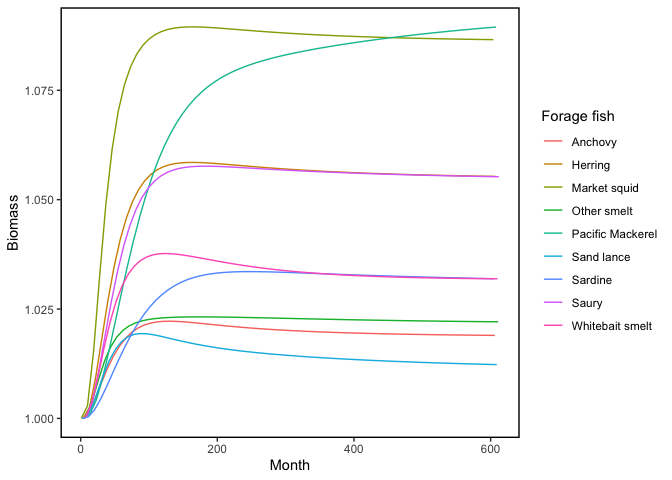

Change over time plot!
======================

``` r
library(viridis)
```

    ## Loading required package: viridisLite

``` r
# color = viridis(n = length(seabirds))
# plot(run1$annual_BB[,1], ylab = "Predator Biomass", col = "White", xlab = "Time", ylim = c(0,0.004))
# for(i in 1:length(seabirds)) {
#   lines(run1$annual_BB[,seabirds[i]], col = color[i])
# }
# par(mar = c(4,4,2,6))
# legend("topright",legend = seabirds, lty = 1, col = color,
#        inset=c(-0.35,0),  xpd = TRUE, cex = 0.5)

change_overtime_plot <- function(species) {
  x = seq(0,1, length.out = length(species))
  color = viridis(n = length(species))
  par(mar = c(6,12,2,4))
  specieyear2 = run2$annual_BB[1, species]
  specieyearlast = run2$annual_BB[length(yearlist), species]
  plot(rev(specieyearlast/specieyear2),x, ylab = "", bg = rev(color), col = "Black",
       xlab = "Biomass proportion", ylim = c(0,1), pch = 21,
       xlim = c(0,1.6), axes = F, frame = F)
  
  axis(2, at =x, labels = rev(species), las = 2, pos = 0, cex.axis = 1.5)
  axis(1, at=c(0.2, 0.4, 0.6, 0.8, 1, 1.2, 1.4, 1.6, 1.8), cex.axis=1, tck=0.01, pos = -0.05)
  abline(v = 1, lty =3)

}
change_overtime_plot(seabirds)
```

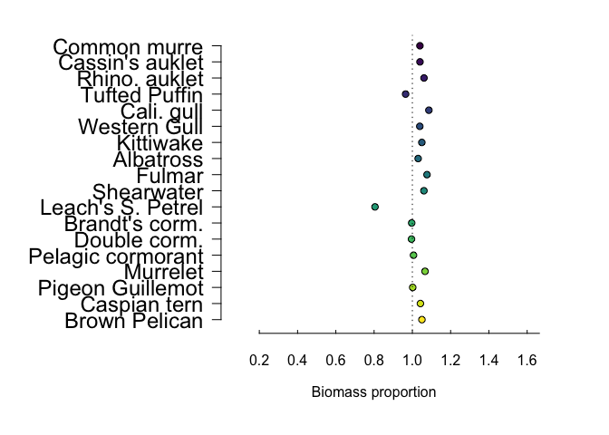

``` r
change_overtime_plot(mammals)
```

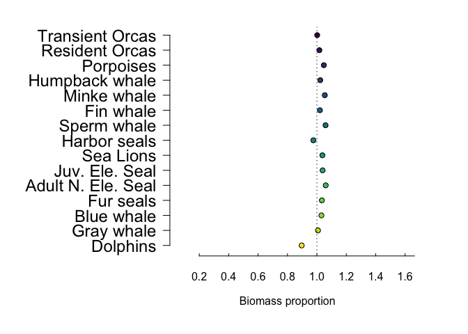

``` r
change_overtime_plot(pred_fish)
```

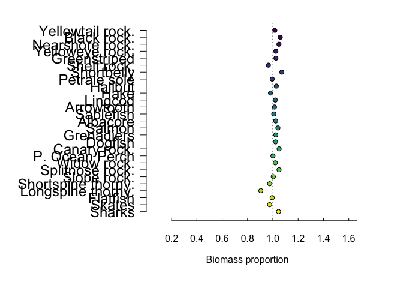

``` r
forage <- Cal_bal$Group[19:27] 
change_overtime_plot(forage)
```

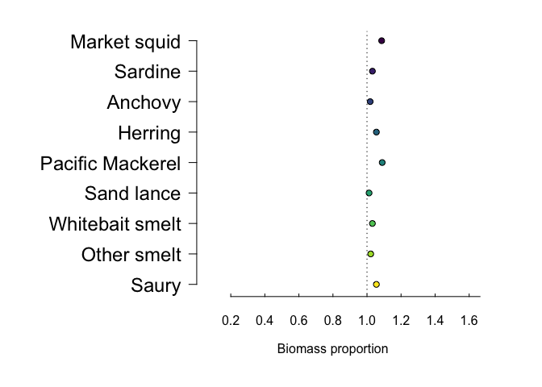

``` r
random = c(Cal_bal$Group[7], Cal_bal$Group[19:22],
           Cal_bal$Group[40:47])
change_overtime_plot(random)
```

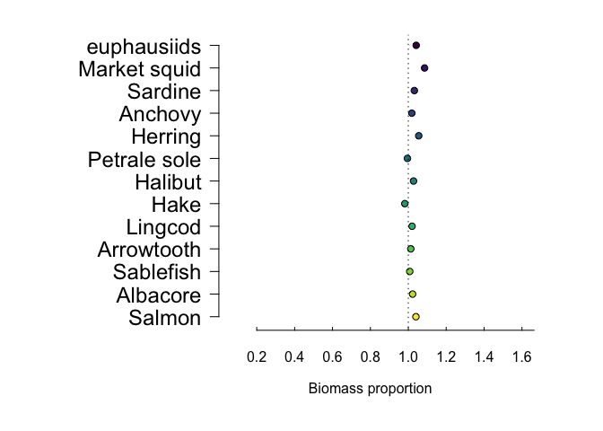

Fish down and recovery scenario, fish for 25 years and stop and look at how popualtion recovers
===============================================================================================

``` r
# helper function to look up the ending biomass of a scenario
end_biomass <- function(rsim){return(rsim$out_BB[dim(rsim$out_BB)[1], 2:(dim(rsim$out_BB)[2])])}
end_biomass
```

    ## function(rsim){return(rsim$out_BB[dim(rsim$out_BB)[1], 2:(dim(rsim$out_BB)[2])])}

``` r
scene2 <- base_sim_scene
scene2 <- adjust.fishing(scene2, "FRATE", "Anchovy", 2000:2020, value=2.0)
scene2 <- adjust.fishing(scene2, "FRATE", "Sardine", 2020:2050, value=1.0)
run2   <- rsim.run(scene2, method='AB', years=yearlist)
rsim.plot(run2,all_species) 
```

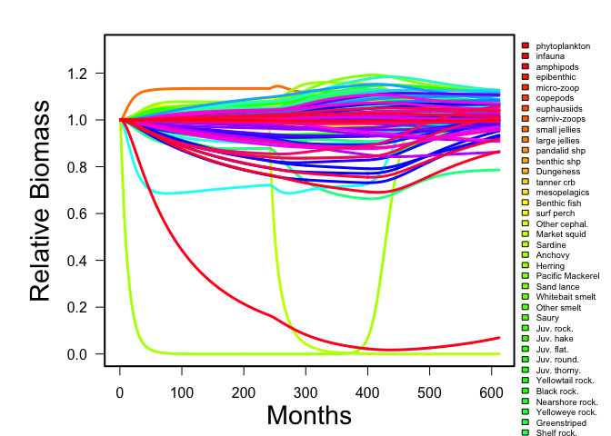

``` r
end_biomass(run2)['mesopelagics']
```

    ## mesopelagics 
    ##     10.43393

After the year 2000, run each year separately, setting each year's target
=========================================================================

fishing rates based on inperfect (randomized) assessment.
=========================================================

``` r
#The issue was: We were running the initial run for the entire time series so the rsim.step was tryign to overwrite the data that was already there, when running a multistep run your initial run is up to the point of your first break

target_sp <- "mesopelagics"
target_F <- 0.75
names(target_F) <- target_sp 

library(data.table)
scene3 <- copy(base_sim_scene)
run3 <- rsim.run(scene3, method = 'AB', years=2000)
for (yr in 2001:2050){
  # stock assessment based on current biomass * error
  assessment <- end_biomass(run3)[target_sp] * (runif(length(target_sp)) + 0.5)
  assessment
  
  # convert target F * assessment to a total catch 
  catches <- target_F * assessment
  
  # apply each catch to each species
  for (sp in target_sp){
    scene3 <- adjust.fishing(scene3, "CATCH", sp, yr, value=catches[sp])
  }
  # run 1 year
  run3 <- rsim.step(scene3, run3, method='AB', year.end=yr) 
}  
rsim.plot(run3,all_species)    
```

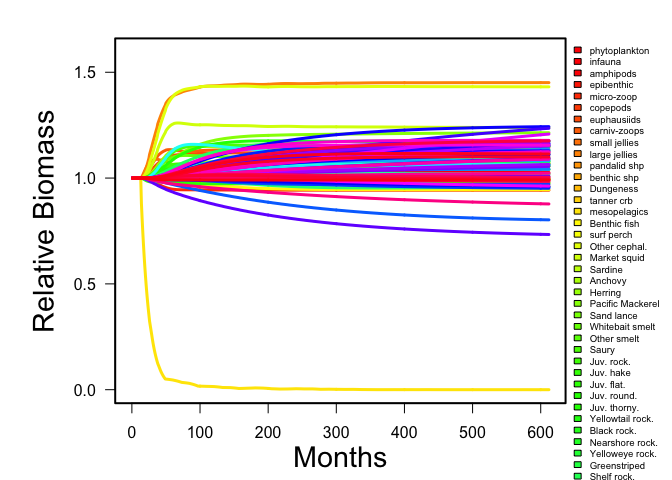
